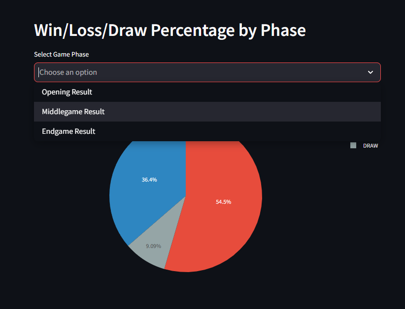

# Chess Game Analyzer

A Python application that analyzes chess games using the Stockfish engine to provide insights into game phases, move quality, and player aggression.

## Features

- **Opening Theory**: Identify opening moves that match established chess theory.
- **Move Quality**: Evaluate the quality of each move based on positional impact.
- **Game Phase Analysis**: Break down games into opening, middlegame, and endgame phases.
- **Position Evaluation**: Provide Stockfish-based evaluations of board positions.
- **Aggression Metrics**: Measure player aggression through move types and tactical patterns.

### Example Output

<p align="center">
  
  
</p>

---

## Setup

### 1. Clone the Repository

```bash
git clone https://github.com/vinny-ho/chess-data-analysis.git
cd chess-data-analysis-main
```

### 2. Install Dependencies

Make sure you have Python installed. Install required packages using:

```bash
pip install -r requirements.txt
```

### 3. Run the Application

Start the Streamlit application:

```bash
streamlit run main.py
```

---

## Usage

1. **Upload PGN File**:
   - Upload a PGN file containing chess games from Chess.com.

2. **Enter Your Chess.com Username**:
   - Provide your username to analyze your games specifically.

3. **View Analysis**:
   - Insights include:
     - **Opening Theory**: Compare openings to established theory.
     - **Move Quality**: Identify mistakes, inaccuracies, and great moves.
     - **Game Phase Analysis**: Understand how you play across different phases of the game.
     - **Position Evaluation**: See Stockfish’s evaluation of key positions.
     - **Aggression Metrics**: Assess tactical patterns and playing style.

---

## Metrics System

### Move Quality

Moves are evaluated based on their impact on the position’s evaluation:

```python
class MoveType(Enum):
    BLUNDER = -3.0     # Major mistake that loses significant advantage
    MISTAKE = -1.0     # Clear mistake that loses advantage
    INACCURACY = -0.5  # Small mistake that loses some advantage
    GREAT_MOVE = 1.0   # Move that gains significant advantage
    GOOD_MOVE = 0.5    # Move that gains some advantage
    BOOK_MOVE = 0      # Standard opening theory move
```

### Aggression Score

Aggression is quantified by the nature of moves:

```python
class AggressionMoveType(Enum):
    CAPTURE = 1.0        # Taking an opponent's piece
    RECAPTURE = 0.2      # Taking back a piece immediately after losing one
    SACRIFICE = 3.0      # Giving up material for positional advantage
    CHECK = 1.5          # Attacking the enemy king
    CENTER = 1.5         # Controlling central squares
    PROMOTION = 3.0      # Promoting a pawn
    CENTER_ATTACK = 0.3  # Attacking central squares
```

The aggression score identifies tactical patterns and playing styles.

---

## Dependencies

Ensure the following packages are installed (managed via `requirements.txt`):

- `chess==1.11.1`
- `pandas==2.2.3`
- `plotly==5.24.1`
- `streamlit==1.41.1`

Install all dependencies with:

```bash
pip install -r requirements.txt
```

---

## Contribution

Contributions are welcomed

---


## Libraries Used

- **Stockfish Chess Engine**: For providing position evaluation.
- **Python-Chess**: For handling chess PGN game data.
- **Pandas**: For data manipulation and analysis.
- **Plotly**: For creating visualizations.
- **Streamlit**: For building web application interface.

---

## License

This project is licensed under the MIT License. See the `LICENSE` file for details.

---
